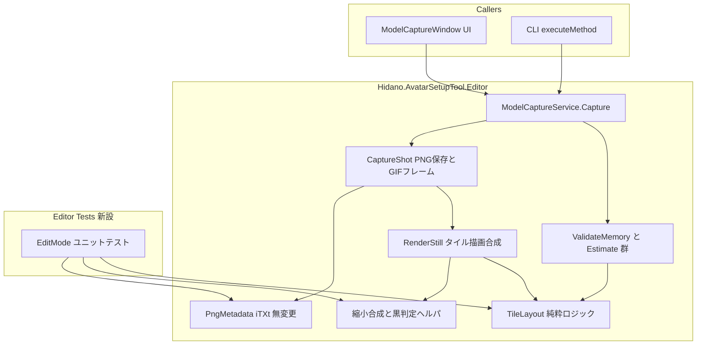
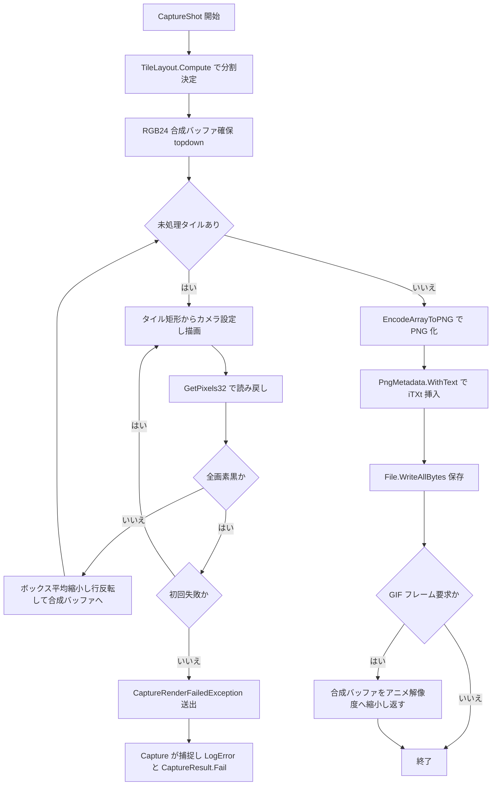
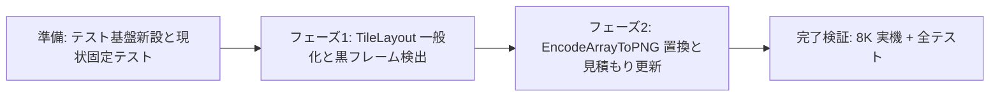

# Design Document — highres-capture-reliability

## Overview

**Purpose**: 本機能は、AvatarSetupTool のモデルキャプチャ利用者に対し、8K (高さ 8192px) などの高解像度静止画を低 VRAM / 低 RAM 環境でも確実かつ省メモリに書き出せる能力を提供する。

**Users**: エディタ UI (ModelCaptureWindow) からの手動撮影、および CLI (`-executeMethod`) からのバッチ撮影を行う利用者が、環境スペックを意識せずに高解像度撮影を実行するために利用する。

**Impact**: 現行の `ModelCaptureService` の静止画レンダリング経路を変更する。(1) タイル辺長を maxTextureSize 基準から「安全上限 4096px + VRAM 予算」基準へ一般化し、巨大 RenderTexture の確保失敗・TDR を排除する。(2) 全画素黒の描画失敗を検出してリトライし、再失敗時は黒 PNG を保存せずエラー報告する。(3) PNG エンコードを RGB24 byte[] 直接エンコード (`ImageConversion.EncodeArrayToPNG`) へ置換し、8K 1 枚あたりの CPU ピークメモリを約 1.5〜2GB から約 0.3〜0.5GB へ削減する。出力仕様 (PNG ピクセル内容・ファイル名・iTXt・動画経路・進捗/キャンセル) は不変。

### Goals
- 8K + SSAA 設定でも 4096px 級タイルの分割描画・合成で確実に撮影を完了する (フェーズ 1)
- 描画失敗 (黒フレーム) を検出・リトライし、黙殺的な黒 PNG 出力をゼロにする (フェーズ 1)
- 8K 静止画 1 枚の CPU ピークメモリを現行比で大幅削減し、メモリ/時間見積もりを新経路に整合させる (フェーズ 2)
- タイルレイアウト・縮小合成・黒判定などの純粋ロジックを Unity Test Runner (EditMode) で検証可能にする

### Non-Goals
- GIF/MP4/ProRes の動画経路の変更 (静止画と共有する縮小関数のシグネチャ追加を除き挙動不変)
- キャプチャ UI の刷新、カメラ設定・構図・背景・グリッドの変更
- 行バンドストリーミング PNG エンコーダ (Option 4-B) の実装 — 4-A でピーク削減が不足した場合のみの予備フェーズ (AC 4.3 は Where 句の条件付き要件であり 4-A 採用時は発火しない)
- 非同期化 (AsyncGPUReadback 等) やジョブ化による高速化

## Boundary Commitments

### This Spec Owns
- 静止画のタイル分割レイアウト計算 (`TileLayout`) と SSAA 倍率決定ポリシー
- 静止画のタイル描画・縮小合成・黒フレーム検出・リトライ・失敗伝搬 (`RenderStill` 経路)
- 静止画の PNG エンコード経路 (合成バッファ形式と `EncodeArrayToPNG` 呼び出し)
- `EstimateRequiredBytes` / `ValidateMemory` / 時間見積もり係数 (静止画分) の算定式
- テスト基盤の新設 (`Tests/Editor` asmdef、`InternalsVisibleTo`)

### Out of Boundary
- `PngMetadata.WithText` の内部仕様 (無変更で利用。4-B 予備フェーズが発動しない限り触らない)
- 動画エンコード経路 (`Mp4Writer` / `ProResWriter` / `GifWriter`) と `AddVideoFrame` の描画経路
- 構図計算 (`ComputeViews` / `GetFaceView`)、グリッド背景 (`GridBackdrop`)、ファイル名解決 (`CaptureFileName`)
- `Capture` の公開シグネチャと `CaptureResult` の形 (フィールド追加を含め変更しない)
- ModelCaptureWindow の UI 挙動 (既存の `result.Error` ダイアログ経路をそのまま使う)

### Allowed Dependencies
- UnityEngine / UnityEditor (PreviewRenderUtility, ImageConversion, SystemInfo, EditorPrefs) — 既存依存の範囲内
- 新規外部パッケージ依存は追加しない (Test Runner の `nunit.framework` はテスト asmdef のみ)
- 依存方向: `TileLayout` (純粋ロジック) ← `ModelCaptureService` ← `ModelCaptureWindow` / CLI 呼び出し元。逆方向の参照は禁止

### Revalidation Triggers
- `Capture` の戻り値契約 (`CaptureResult`) または例外送出方針を変える場合
- PNG の出力バイト仕様 (ピクセル内容・チャンク構成) に影響する変更を行う場合
- `EstimateRequiredBytes` / `EstimateCaptureSeconds` の公開シグネチャを変える場合
- 4-B (ストリーミングエンコーダ) を発動し `PngMetadata` を改修する場合

## Architecture

### Existing Architecture Analysis
- `ModelCaptureService` は UI 非依存の static ロジック層で、`Capture` が結果を `CaptureResult` で返す契約。CLI もこの契約に依存する — 本設計はこの契約を維持する。
- 静止画は既に「正射影カメラをずらすタイル分割 + `DownscaleInto` (整数ボックス平均) 合成」の構造を持つ。ただし分割条件が maxTextureSize 超過時のみ、分割数が SSAA 倍率の 2 冪約数に限定されている。**再利用**: タイル描画+合成ループと `DownscaleInto` の骨格。**一般化**: タイル辺長の算出と非一様タイルのカメラ矩形計算。
- `CaptureShot` は静止画ピクセルを GIF フレームと共有する (描画 1 回)。合成バッファの形式変更はこの結合に波及する。
- リポジトリにテストは存在しない。純粋ロジックの抽出とテスト asmdef 新設が前提整備になる。

### Architecture Pattern & Boundary Map

採用パターン: **ハイブリッド (Option C)** — 純粋ロジックを internal 型/メソッドとして抽出し、描画経路 (`RenderStill` / `CaptureShot`) はインプレース修正する。出力仕様不変の制約下で差分を最小化しつつ、計算ロジックを単体テスト可能にする (代替案比較は research.md)。



**Key Decisions**:
- `TileLayout` はレンダリング状態を持たない純粋な計算 (整数演算のみ) として分離し、`RenderStill` と `ValidateMemory` / 時間見積もりの両方が同一のレイアウト結果を参照する — 見積もりと実行の乖離 (5.1, 5.2) を構造的に防ぐ。
- 失敗伝搬は「internal 例外 → `Capture` が捕捉 → `CaptureResult.Fail`」。公開契約を変えずに UI/CLI 双方へ失敗を届ける (3.3, 6.4, 6.5)。
- 既存パターン維持: static クラス構成、`CaptureResult` 契約、`PngMetadata` の後付け iTXt 挿入、進捗コールバック契約。

### Technology Stack

| Layer | Choice / Version | Role in Feature | Notes |
|-------|------------------|-----------------|-------|
| Editor Runtime | Unity 6000.3 (Editor 専用パッケージ) | PreviewRenderUtility による正射影タイル描画 | 既存依存。変更なし |
| 画像エンコード | `ImageConversion.EncodeArrayToPNG` + `GraphicsFormat.R8G8B8_SRGB` | RGB24 byte[] からの PNG 直接エンコード (Texture2D 非経由) | 新規使用 API (2020.1+)。行順・フォーマットの最終確定はピクセル一致テストで行う (research.md) |
| メタデータ | `PngMetadata.WithText` (既存 internal) | iTXt チャンク挿入 | 無変更 |
| 環境情報 | `SystemInfo.maxTextureSize` / `graphicsMemorySize` / `systemMemorySize` | タイル辺長とメモリ予算の算出 | graphicsMemorySize は過小報告があるため下限クランプ必須 (research.md) |
| テスト | Unity Test Framework (EditMode) + NUnit | 純粋ロジックの単体テストと描画一致テスト | 新規導入。パッケージ埋め込みのため manifest 変更不要 |

## File Structure Plan

### Directory Structure
```
AvatarSetupTool/Packages/com.hidano.avatarsetuptool/
├── Editor/
│   ├── ModelCaptureService.cs        # 修正: RenderStill/CaptureShot/SSAA/見積もり
│   ├── TileLayout.cs                 # 新規: タイルレイアウト純粋ロジック
│   ├── AssemblyInfo.cs               # 新規: InternalsVisibleTo(Tests)
│   ├── PngMetadata.cs                # 無変更 (テスト対象にはなる)
│   ├── CaptureSettings.cs            # 原則無変更 (定数追加が必要な場合のみ)
│   └── Hidano.AvatarSetupTool.Editor.asmdef  # 無変更
└── Tests/
    └── Editor/
        ├── Hidano.AvatarSetupTool.Editor.Tests.asmdef  # 新規
        ├── TileLayoutTests.cs        # レイアウト計算の網羅検証
        ├── DownscaleTests.cs         # 縮小合成のタイル分割 vs 単一の等価性
        ├── BlackFrameTests.cs        # 黒判定述語
        ├── PngEncodeTests.cs         # EncodeArrayToPNG のピクセル一致・ラウンドトリップ
        ├── PngMetadataTests.cs       # WithText のチャンク仕様
        └── TileRenderEquivalenceTests.cs  # 小サイズでのタイル描画 vs 単一描画一致 (統合)
```

### Modified Files
- `Editor/ModelCaptureService.cs` — 中心的変更。(1) `TileCount` / `TilePixels` / `StillSuperSample` の VRAM 降格を `TileLayout` 参照へ置換。(2) `RenderStill` を非一様タイル対応 + 黒フレーム検出/リトライ + RGB24 top-down 合成へ変更。(3) `CaptureShot` を `EncodeArrayToPNG` 経路へ変更し GIF フレーム生成を新バッファ形式に追随。(4) `ValidateMemory` / `EstimateRequiredBytes` / レート定数を新経路の実態へ更新。(5) internal 例外 `CaptureRenderFailedException` の捕捉を `Capture` に追加。テスト対象ヘルパ (`DownscaleInto` 系・黒判定) は private → internal へ昇格。
- `Editor/Hidano.AvatarSetupTool.Editor.asmdef` — 変更なし (InternalsVisibleTo は `AssemblyInfo.cs` で付与)。
- `Editor/CaptureSettings.cs` — 機能変更なし。`MaxImageSize` 等の既存定数は維持。

## System Flows

### 静止画 1 枚のタイル描画・検証・エンコード



フロー上の決定事項:
- 黒判定はタイル読み戻し直後 (合成前) に行う。リトライは同一タイルにつき 1 回のみで、同一 `PreviewRenderUtility` を再利用する (preview の再生成は行わない — TDR 復旧は保証不能なため、予防 = タイル小型化を主対策とする。research.md)。
- 例外は PNG 保存より前に送出されるため、黒 PNG がディスクに書かれることはない (3.3)。
- 単一パス描画 (1.2) は「1×1 タイルのレイアウト」として同一フローで扱い、分岐を持たない。
- キャンセル判定はタイルループの各反復前にも行う (6.3)。進捗コールバックへは直前と同一の進捗テキスト・進捗値を渡すため、コールバック契約と進捗表示は不変のまま応答性のみ向上する。キャンセル検出時は合成・エンコード・保存へ進まずに脱出するため、書きかけの PNG は残らない。

## Requirements Traceability

| Requirement | Summary | Components | Interfaces | Flows |
|-------------|---------|------------|------------|-------|
| 1.1 | タイル辺長を安全上限と VRAM 予算から算出し分割描画 | TileLayout, RenderStill | `TileLayout.Compute`, `ComputeTileSideLimit` | タイル描画フロー |
| 1.2 | 辺長以下なら単一パス描画 | TileLayout | `TileLayout.Compute` (1×1 レイアウト) | 同上 |
| 1.3 | SSAA 約数制約なしの任意分割数 | TileLayout | `TileLayout.GetTile` (非一様矩形) | 同上 |
| 1.4 | 合成結果が単一描画と一致 (完全一致目標、各チャンネル ±1 階調以内許容) | TileLayout, RenderStill, 縮小合成ヘルパ | `DownscaleIntoRgb24` (境界整列) + double 精度カメラ換算 | 同上 |
| 1.5 | タイル RT が maxTextureSize と算出辺長を超えない | TileLayout | `ComputeTileSideLimit` の min 構成 | — |
| 2.1 | 解像度既定の SSAA 倍率 (≤2048→4, 超→2) | SSAA ポリシー | `TileLayout.Compute` の preferredFactor | — |
| 2.2 | タイルが予算内なら SSAA を 1 に落とさない | SSAA ポリシー, TileLayout | 同上 (VRAM 降格の撤去) | — |
| 2.3 | 降格が必要な場合は警告ログ + 適用倍率の可視化 | SSAA ポリシー | `TileLayout.Compute` の縮退条件 + 警告ログ | — |
| 3.1 | 読み戻し完了時に全画素黒を検査 | 黒フレーム検出 | `IsAllBlack` | タイル描画フロー |
| 3.2 | 黒検出時 1 回リトライ | RenderStill | リトライループ | 同上 |
| 3.3 | 再失敗はエラー報告し黒 PNG を保存しない | 失敗伝搬 | `CaptureRenderFailedException` → `CaptureResult.Fail` | 同上 |
| 3.4 | エラーに解像度・タイル情報を含める | 失敗伝搬 | 例外のコンテキストフィールド | — |
| 4.1 | 全面中間コピーを経由しない省メモリ経路 | PNG エンコード経路 | `EncodeArrayToPNG` + RGB24 合成バッファ | エンコードフロー |
| 4.2 | 8K のピークメモリを現行比削減 | PNG エンコード経路, RenderStill | バッファ構成 (下記 Data Models) | — |
| 4.3 | (条件付き: ストリーミング採用時のみ) 全面バッファなし | — (4-A 採用のため発火しない。4-B 予備のみ) | — | — |
| 4.4 | 現行経路と同一ピクセルの PNG | PNG エンコード経路 | ピクセル一致テスト (Testing Strategy) | — |
| 4.5 | 同一仕様の iTXt 付与 | PNG エンコード経路 | `PngMetadata.WithText` (無変更) | エンコードフロー |
| 5.1 | EstimateRequiredBytes を新経路の実使用量へ | 見積もり | `EstimateRequiredBytes` 改定式 | — |
| 5.2 | ValidateMemory が新経路基準で誤拒否しない | 見積もり | `ValidateMemory` (TileLayout 共有) | — |
| 5.3 | 時間見積もり係数の更新 | 見積もり | レート定数 + `EstimateSecondsForViews` | — |
| 6.1 | PNG 内容・ファイル名・iTXt 仕様不変 | PNG エンコード経路 | ピクセル一致テスト + WithText 無変更 | — |
| 6.2 | 動画経路の動作不変 | (境界外の維持) | `Downscale` / `AddVideoFrame` 無変更 | — |
| 6.3 | 進捗・キャンセル動作の維持 (タイル単位判定による応答性向上は許容) | RenderStill | 進捗コールバック契約の不変 + タイル間キャンセル判定 | タイル描画フロー |
| 6.4 | CLI で UI 非依存に完了 | 失敗伝搬 | Result 契約 + `Debug.LogError` | — |
| 6.5 | CLI 失敗を判別可能に報告 | 失敗伝搬 | `CaptureResult.Fail` + LogError | — |

## Components and Interfaces

| Component | Domain/Layer | Intent | Req Coverage | Key Dependencies | Contracts |
|-----------|--------------|--------|--------------|------------------|-----------|
| TileLayout | 純粋ロジック | タイル分割と SSAA 倍率の決定 | 1.1–1.5, 2.1–2.3 | SystemInfo 値 (引数渡し, P0) | Service |
| RenderStill パイプライン | レンダリング | タイル描画・黒検出・リトライ・合成 | 1.1–1.4, 3.1, 3.2, 6.3 | TileLayout (P0), PreviewRenderUtility (P0) | Service |
| 黒フレーム検出 | 純粋ロジック | 全画素黒の述語 | 3.1 | なし | Service |
| 失敗伝搬 | エラー処理 | 内部例外 → CaptureResult 変換 | 3.3, 3.4, 6.4, 6.5 | CaptureResult (P0) | Service |
| PNG エンコード経路 | エンコード | RGB24 直接エンコード + iTXt + GIF フレーム共有 | 4.1, 4.2, 4.4, 4.5, 6.1 | ImageConversion (P0), PngMetadata (P0), GifWriter (P1) | Service |
| 見積もり更新 | 検証/UI 連携 | メモリ・時間見積もりの新経路整合 | 5.1–5.3 | TileLayout (P0) | Service |
| テスト基盤 | テスト | asmdef 新設と internal 公開 | (全要件の検証手段) | 本体 asmdef (P0), Test Framework (P0) | — |

### 純粋ロジック層

#### TileLayout

| Field | Detail |
|-------|--------|
| Intent | 出力解像度・SSAA 倍率・環境制約からタイル分割 (数・矩形・適用倍率) を一意に決定する |
| Requirements | 1.1, 1.2, 1.3, 1.5, 2.1, 2.2, 2.3 |

**Responsibilities & Constraints**
- 入力 (出力サイズ・希望倍率・辺長上限) から決定的にレイアウトを算出する。Unity API を呼ばない (環境値は引数で受ける) — 単体テストの前提。
- 不変条件: (a) 全タイルの矩形は出力ピクセル空間を重複・欠落なく被覆する。(b) 各タイルのレンダサイズ `blockSide × factor` は辺長上限以下。(c) タイル境界は常に出力ピクセル境界 (= SSAA 倍率 × 出力 px のレンダ境界) に整列する — ピクセル同一合成 (1.4) の根拠。
- SSAA 倍率: 希望倍率 (最長辺 ≤2048 → 4、超 → 2。現行と同一) をそのまま採用。`tileSideLimit / factor < MinBlockSide (64)` の縮退時のみ倍率を段階的に下げ、呼び出し側が警告ログを出せるよう「要求倍率と適用倍率」を結果に含める (2.3)。

**Dependencies**
- Inbound: RenderStill / ValidateMemory / EstimateRequiredBytes / EstimateSecondsForViews — レイアウト取得 (P0)
- External: なし (SystemInfo 値は呼び出し側が引数で注入)

**Contracts**: Service [x]

##### Service Interface
```csharp
/// <summary>静止画のタイル分割レイアウト。純粋な整数計算で、環境値は引数で受ける。</summary>
internal readonly struct TileLayout
{
    /// <summary>実際に適用する SSAA 倍率 (縮退時は requested より小さい)。</summary>
    public int Factor { get; }
    /// <summary>要求した SSAA 倍率 (警告ログ用)。</summary>
    public int RequestedFactor { get; }
    public int TilesX { get; }
    public int TilesY { get; }
    /// <summary>単一パスかどうか (TilesX == 1 && TilesY == 1)。</summary>
    public bool IsSinglePass { get; }

    /// <summary>
    /// レイアウトを算出する。outputWidth/Height は出力 PNG のピクセルサイズ、
    /// preferredFactor は解像度既定の SSAA 倍率、tileSideLimit はレンダ辺長上限 (px)。
    /// </summary>
    public static TileLayout Compute(
        int outputWidth, int outputHeight, int preferredFactor, int tileSideLimit);

    /// <summary>タイル (tx, ty) の出力ピクセル空間での矩形。端タイルは剰余サイズ。</summary>
    public TileRect GetTile(int tx, int ty);

    /// <summary>タイル 1 枚の最大レンダピクセル数 (メモリ見積もり用)。</summary>
    public long MaxTileRenderPixels { get; }
}

/// <summary>出力ピクセル空間のタイル矩形。</summary>
internal readonly struct TileRect
{
    public int X { get; }
    public int Y { get; }
    public int Width { get; }
    public int Height { get; }
}

internal static class TileSideLimits
{
    /// <summary>TDR と確保失敗を避けるレンダ辺長の安全上限 (px)。</summary>
    internal const int SafeTileSide = 4096;
    /// <summary>graphicsMemorySize 過小報告対策の下限クランプ (MB)。</summary>
    internal const int VramFloorMb = 1024;

    /// <summary>
    /// min(SafeTileSide, maxTextureSize, VRAM 予算由来の辺長) を返す。
    /// VRAM 予算 = max(graphicsMemoryMb, VramFloorMb) / 2、辺長 = sqrt(予算 / 12 bytes/px)。
    /// </summary>
    internal static int Compute(int maxTextureSize, int graphicsMemoryMb);
}
```
- Preconditions: `outputWidth, outputHeight > 0`、`preferredFactor ∈ {1, 2, 4}`、`tileSideLimit ≥ 64`
- Postconditions: 全タイル矩形の合併 = 出力全域 (重複なし)。`GetTile(...).Width * Factor ≤ tileSideLimit` (高さも同様)
- Invariants: 同一入力に対し常に同一結果 (決定的)

**Implementation Notes**
- Integration: タイル数は `maxBlock = tileSideLimit / factor` (出力 px) に対する `ceil(size / maxBlock)`。標準タイルは `maxBlock`、最終タイルのみ剰余。カメラ矩形換算は RenderStill 側の責務 (下記)。
- Validation: 境界値テスト (8192×2 / 4096 = 4 分割、非正方形、剰余あり、1×1) を TileLayoutTests で網羅。
- Risks: なし (純粋計算)。

#### 黒フレーム検出

| Field | Detail |
|-------|--------|
| Intent | 読み戻したタイルが描画失敗 (全画素黒) かを判定する |
| Requirements | 3.1 |

**Responsibilities & Constraints**
- 判定は「全画素で `r == 0 && g == 0 && b == 0`」の厳密比較。アルファは無視する (research.md: 背景は常に不透明グレー 184 のため、正常フレームに全画素黒はあり得ない)。
- 非黒画素を発見した時点で即座に false を返す (正常系はほぼ先頭で終了し、コストは無視できる)。

**Dependencies**: なし (純粋関数)

**Contracts**: Service [x]

##### Service Interface
```csharp
/// <summary>全画素が RGB=(0,0,0) なら true (アルファ無視)。非黒発見で早期終了。</summary>
internal static bool IsAllBlack(Color32[] pixels);
```

### レンダリング層

#### RenderStill パイプライン (ModelCaptureService 内、インプレース修正)

| Field | Detail |
|-------|--------|
| Intent | TileLayout に従ってタイルを描画・検証し、RGB24 top-down 合成バッファを構築する |
| Requirements | 1.1, 1.2, 1.3, 1.4, 3.1, 3.2, 6.3 |

**Responsibilities & Constraints**
- タイルごとに: 出力ピクセル矩形 → ワールド空間カメラ矩形の換算 (正射影)。`worldPerPixel = 2 * OrthoSize / outputHeight` を基準に、`tileOrtho = OrthoSize * rect.Height / outputHeight`、タイル中心 = 構図中心 + ピクセルオフセット換算。非一様タイル (端の剰余) でもピクセル境界に正確に一致させる。
- 描画 → `GetPixels32` → `IsAllBlack` 検査 → (黒なら同一タイルを 1 回だけ再描画・再検査。再失敗で `CaptureRenderFailedException`) → `DownscaleIntoRgb24` で合成バッファへ書き込み。
- 進捗・キャンセル: 既存どおり `CaptureShot` 単位の進捗コールバックを維持する (タイル単位のコールバック追加は行わない — 6.3 の「既存動作の維持」を厳守)。
- タイル用 `Texture2D` は各タイル処理後に即 `DestroyImmediate` し、同時生存を 1 枚に保つ。

**Dependencies**
- Inbound: CaptureShot — 静止画ピクセルの取得 (P0)
- Outbound: TileLayout (P0)、PreviewRenderUtility / RenderView (P0)、DownscaleIntoRgb24 (P0)、IsAllBlack (P0)

**Contracts**: Service [x]

##### Service Interface
```csharp
/// <summary>
/// 静止画 1 枚をタイル分割 SSAA 描画し、RGB24 (3 bytes/px)・top-down 行順の
/// 合成バッファを返す。描画失敗 (リトライ後も全画素黒) 時は
/// CaptureRenderFailedException を送出し、部分結果を返さない。
/// </summary>
private static byte[] RenderStill(PreviewRenderUtility preview, ViewSpec view);

/// <summary>
/// source (Color32[]、ボトムアップ行順) をボックス平均で 1/factor に縮小し、
/// dest (RGB24 byte[]、top-down 行順) の出力矩形 (destX, destY, blockWidth, blockHeight)
/// へ行反転しながら書き込む。丸めは現行 DownscaleInto と同一 (samples/2 加算の四捨五入)。
/// </summary>
internal static void DownscaleIntoRgb24(
    Color32[] source, int sourceWidth, int factor,
    byte[] dest, int destWidth, int destHeight,
    int destX, int destY, int blockWidth, int blockHeight);
```
- Preconditions: `source.Length == blockWidth * factor * blockHeight * factor` (タイル全域)
- Postconditions: 合成結果は同一入力を単一描画 + 現行 `DownscaleInto` で処理した結果とチャネル値が一致する (丸め式が同一のため)
- Invariants: 既存 `DownscaleInto` (Color32 版) は動画/GIF 経路のため無変更で残す

**Implementation Notes**
- Integration: 現行 `RenderStill` の一様タイル前提 (`tileOrtho = OrthoSize / tilesY` 等) を `TileRect` ベースの換算へ置換。`TileCount` / `TilePixels` は削除し `TileLayout` へ一本化。
- Validation: TileRenderEquivalenceTests (小サイズ・強制多タイル vs 単一パスの全ピクセル比較、EditMode で PreviewRenderUtility を直接使用)。
- Risks: 非一様タイル境界のラスタライズ誤差 — 矩形を整数ピクセルで定義しカメラを厳密換算することで防ぐ。等価性テストで検出可能。

### エラー処理層

#### 失敗伝搬 (CaptureRenderFailedException)

| Field | Detail |
|-------|--------|
| Intent | 描画失敗を黒 PNG を残さずに UI / CLI 双方へ判別可能な失敗として届ける |
| Requirements | 3.3, 3.4, 6.4, 6.5 |

**Responsibilities & Constraints**
- `RenderStill` 深部からの脱出手段として internal 例外を用い、`Capture` の try ブロックで捕捉して `Debug.LogError` + `CaptureResult.Fail(message)` に変換する。公開契約 (`CaptureResult` の形、例外を投げない Capture) は不変。
- メッセージには原因究明情報を含める: 対象名/構図 (full/BS)/方向、出力解像度、SSAA 要求/適用倍率、タイル位置とタイル数、タイルのレンダピクセスサイズ、`maxTextureSize` / `graphicsMemorySize` の値 (3.4)。
- ModelCaptureWindow は既存の `result.Error` ダイアログ経路をそのまま使用し、CLI は `CaptureResult` とエラーログで失敗を判別する (6.4, 6.5)。撮影途中の失敗でも、それ以前に保存済みの正常 PNG はそのまま残す (部分成功の扱いは現行のキャンセル時と同様)。

**Contracts**: Service [x]

##### Service Interface
```csharp
/// <summary>リトライ後も黒フレームだった描画失敗。診断情報をメッセージに含める。</summary>
internal sealed class CaptureRenderFailedException : Exception
{
    public CaptureRenderFailedException(string message);
}
```
- Postconditions: 本例外の経路では PNG ファイルは一切書き込まれない (送出は保存前)

### エンコード層

#### PNG エンコード経路 (CaptureShot、インプレース修正)

| Field | Detail |
|-------|--------|
| Intent | RGB24 合成バッファを Texture2D 非経由で PNG 化し、iTXt と GIF フレーム共有を維持する |
| Requirements | 4.1, 4.2, 4.4, 4.5, 6.1, 6.2 |

**Responsibilities & Constraints**
- `RenderStill` の戻り値 (RGB24 byte[]、top-down) を `ImageConversion.EncodeArrayToPNG(buffer, GraphicsFormat.R8G8B8_SRGB, width, height, rowBytes: width * 3)` で直接エンコードする。現行の `Texture2D(RGB24)` + `SetPixels32` + `EncodeToPNG` は静止画経路から撤去。
- iTXt: エンコード結果に対し既存 `PngMetadata.WithText(bytes, "Comment", debugText)` を無変更で適用 (4.5, 6.1)。
- GIF フレーム共有: 合成バッファ (出力解像度・top-down) をアニメ解像度へ `SuperSampleFactor` でボックス平均縮小する RGB24→Color32 変換を新設。top-down 入力 → top-down 出力なので現行の反転処理は不要になる (GIF は top-down を要求。現行と同一の画素値になることを DownscaleTests で保証)。
- 動画経路 (`AddVideoFrame` / `Downscale` Color32 版) は無変更 (6.2)。

**Dependencies**
- Outbound: ImageConversion (External, P0)、PngMetadata (P0)
- Inbound: GifWriter — 縮小フレームの受領 (P1)

**Contracts**: Service [x]

##### Service Interface
```csharp
/// <summary>
/// RGB24 top-down バッファをアニメ解像度の Color32[] (top-down) へボックス平均縮小する。
/// GIF フレーム共有用。丸めは DownscaleInto と同一。
/// </summary>
internal static Color32[] DownscaleRgb24ToColor32(
    byte[] source, int sourceWidth, int sourceHeight, int destWidth, int destHeight);
```

**Implementation Notes**
- Integration: `CaptureShot` のシグネチャ (戻り値 `Color32[]` = GIF フレーム or null) は維持し、内部実装のみ差し替える。
- Validation: PngEncodeTests — 同一ピクセルを現行経路 (`Texture2D.EncodeToPNG`) と新経路でエンコードし、**デコード後のピクセル値完全一致**を検証する (PNG バイト列自体は圧縮器差で異なってよい。AC 4.4 は「同一のピクセル内容」)。この検証が `R8G8B8_SRGB` の妥当性と top-down 行順の推定 (research.md) を実装時に確定する。
- Risks: EncodeArrayToPNG の行順が推定と逆 — テストで即検出し、合成時の行方向定数の反転のみで吸収 (アーキテクチャ影響なし)。

### 見積もり層

#### メモリ・時間見積もり更新 (インプレース修正)

| Field | Detail |
|-------|--------|
| Intent | ValidateMemory / EstimateRequiredBytes / 時間係数を新経路の実バッファ構成へ整合させる |
| Requirements | 5.1, 5.2, 5.3, 2.2 |

**Responsibilities & Constraints**
- 公開シグネチャ (`EstimateRequiredBytes(int, CaptureOutputFormat, CaptureViewMode)`、`MemoryBudgetBytes`、`EstimateCaptureSeconds`) は不変。算定式のみ更新。
- 静止画 1 枚のピーク算定 (新経路):
  - RGB24 合成バッファ: `W × H × 3`
  - タイル読み戻し: `MaxTileRenderPixels × 4 × 2` (GetPixels32 配列 + Texture2D の CPU 側コピー)
  - PNG エンコード出力 + WithText コピー: `W × H × 1 × 2` (圧縮後サイズの安全側概算)
  - GIF 蓄積分は現行式を維持
- `ValidateMemory` は `TileLayout` から得た実際の適用倍率・タイルサイズで算定する (見積もりと実行の一致 — 5.2)。**維持するガード**: 出力レンダ解像度自体の `maxTextureSize` 超過チェックは現行どおり残す。**撤去するもの**: VRAM 予算による SSAA 降格 (タイル分割が肩代わり — 2.2)。
- 時間係数: `StillRenderRate` (タイルオーバーヘッド込みで実測再較正)、`PngEncodeRate` (EncodeArrayToPNG の実測値) を更新。`EstimateSecondsForViews` の SSAA 倍率参照は `TileLayout` の適用倍率へ差し替え。残差は既存の `TimeCalibrationFactor` 平滑化が吸収する (5.3)。

**Contracts**: Service [x] (既存公開 API の意味的更新のみ、シグネチャ不変)

**Implementation Notes**
- Integration: `EstimateRequiredBytes` は構図確定前の正方形仮定という現行の性格を維持し、`TileSideLimits.Compute` と同じ辺長を仮定に使う。
- Validation: 8K/Both/GIF などの代表設定で「新見積もり ≤ 現行見積もり」かつ「MemoryBudgetBytes との比較で 8K が誤拒否されない」ことをテストで確認 (SystemInfo 依存部は引数化した内部関数を検証)。
- Risks: 係数の初期値ずれ — TimeCalibrationFactor が撮影ごとに補正するため許容。

### テスト基盤

#### Tests/Editor asmdef + InternalsVisibleTo

| Field | Detail |
|-------|--------|
| Intent | internal ロジックを EditMode テストから検証可能にする |
| Requirements | (全要件の検証手段。直接対応する AC はなし — Adjacent expectation「Unity Test Runner で実行可能」に対応) |

**Responsibilities & Constraints**
- `Editor/AssemblyInfo.cs` に `[assembly: InternalsVisibleTo("Hidano.AvatarSetupTool.Editor.Tests")]` を追加。
- テスト asmdef: `references` に本体 asmdef + `UnityEngine.TestRunner` + `UnityEditor.TestRunner`、`precompiledReferences` に `nunit.framework.dll`、`defineConstraints` に `UNITY_INCLUDE_TESTS`、`includePlatforms` は Editor のみ。
- 埋め込みパッケージのため `manifest.json` の `testables` 追加は不要 (research.md)。

## Data Models

本機能はファイル/DB スキーマを持たない。設計上の「データ」はメモリ内ピクセルバッファの契約であり、これが全コンポーネント間の整合の要になる。

### ピクセルバッファ契約

| バッファ | 形式 | 行順 | 所有者 | 消費者 |
|----------|------|------|--------|--------|
| タイル読み戻し | `Color32[]` (RGBA, 4 bytes/px) | ボトムアップ (GetPixels32 仕様) | RenderStill (タイル毎に使い捨て) | IsAllBlack, DownscaleIntoRgb24 |
| 静止画合成バッファ | `byte[]` RGB24 (3 bytes/px) | **top-down** (EncodeArrayToPNG 要求仕様・要実装時確定) | RenderStill → CaptureShot | EncodeArrayToPNG, DownscaleRgb24ToColor32 |
| GIF フレーム | `Color32[]` (アニメ解像度) | top-down (GifWriter 要求) | CaptureShot | GifWriter |
| 動画フレーム | `Color32[]` (アニメ解像度) | ボトムアップ (現行のまま) | AddVideoFrame | Mp4Writer / ProResWriter |

**不変条件**:
- ボックス平均の丸め式 (`(sum + samples/2) / samples`) は全縮小関数で同一とする — タイル分割 vs 単一、GIF フレームの現行同値性の根拠。
- 行反転は「タイル読み戻し (ボトムアップ) → 合成バッファ (top-down)」の 1 箇所でのみ行い、以降の経路では行順変換をしない。

### 8K ピークメモリ比較 (設計目標値、AC 4.2)

| 項目 | 現行 | 新経路 |
|------|------|--------|
| 全面 Color32[] | 256 MB | — |
| タイル GetPixels32 + Texture2D | 〜1 GB (16384px タイル) | 〜134 MB (4096px タイル ×2) |
| 全面 Texture2D (SetPixels32) | 256 MB | — |
| EncodeToPNG 中間 + 出力 | 数百 MB | — |
| RGB24 合成バッファ | — | 201 MB |
| EncodeArrayToPNG 出力 + WithText | — | 〜134 MB |
| **概算ピーク** | **1.5〜2 GB** | **約 0.35〜0.5 GB** |

## Error Handling

### Error Strategy
描画失敗は「検出 → 限定リトライ → 明示的失敗」の三段構え。黙殺的な黒 PNG 出力の排除 (3.3) を最優先とし、失敗時も `Capture` の Result 契約内で報告する。

### Error Categories and Responses
- **描画失敗 (黒フレーム、TDR/確保失敗起因)**: タイル毎に検出、同一タイルを 1 回リトライ。再失敗で `CaptureRenderFailedException` → `Capture` が `Debug.LogError` + `CaptureResult.Fail`。UI はダイアログ、CLI はログ + 戻り値で判別 (6.4, 6.5)。メッセージに構図・解像度・SSAA 倍率・タイル座標/総数・環境値を含める (3.4)。
- **事前検証エラー (メモリ超過・maxTextureSize 超過・H.264 上限)**: 現行どおり `ValidateMemory` が撮影前に `CaptureResult.Fail` を返す。新経路の見積もり式により、実際には撮影可能な 8K 設定を誤拒否しない (5.2)。
- **SSAA 縮退 (極端な低スペック)**: エラーではなく警告。`Debug.LogWarning` で要求倍率と適用倍率を明示し撮影は続行する (2.3)。
- **エンコード失敗 (EncodeArrayToPNG が null/空を返す)**: 防衛的にチェックし、`CaptureRenderFailedException` と同経路で失敗報告する (黒 PNG 同様、壊れたファイルを残さない)。
- **キャンセル**: 現行の `CaptureResult.Cancel` 経路を無変更で維持 (6.3)。

### Monitoring
- 失敗時: `Debug.LogError` (CLI ログで検出可能)。リトライ発生時: `Debug.LogWarning` でタイル座標を記録 (成功しても環境の予兆として可視化)。
- 成功時: 既存のサマリログ + `TimeCalibrationFactor` 更新を維持。

## Testing Strategy

### Unit Tests (EditMode、純粋ロジック)
1. **TileLayoutTests**: 8192×8192 ×2 / 上限 4096 → 4×4 分割、非正方形 (WideModel)、剰余タイル、上限以下 → 1×1 (1.2)、縮退条件での倍率降格と Requested/Applied の報告 (2.3)、被覆・整列不変条件のプロパティ検証 (1.3, 1.5)
2. **DownscaleTests**: `DownscaleIntoRgb24` のタイル分割合成 vs 単一 `DownscaleInto` 相当の全画素一致 (1.4)、`DownscaleRgb24ToColor32` と現行 `Downscale(topDown: true)` の同値性 (GIF 不変、6.2)
3. **BlackFrameTests**: 全黒 → true、1 画素のみ非黒 (先頭/末尾/中間) → false、アルファのみ非ゼロの全黒 → true (3.1)
4. **PngEncodeTests**: 乱数 + 背景色パターンの RGB24 バッファを新経路でエンコード → デコードし、`EncodeToPNG` 経由の結果とピクセル値完全一致 (4.4, 6.1)。行順の正しさ (最上段に置いたマーカー画素が PNG 先頭行に現れる)
5. **PngMetadataTests**: `WithText` の挿入位置 (IHDR 直後)・CRC・UTF-8 本文のラウンドトリップ (4.5)

### Integration Tests (EditMode、GPU 使用)
1. **TileRenderEquivalenceTests**: 小サイズ (例 512px) で tileSideLimit を強制的に絞り、多タイル描画と単一パス描画の全ピクセル一致を検証 (1.4)
2. **Capture 経路スモーク**: 小型テストモデルで `Capture` を実行し、PNG が生成され iTXt が読めること、`CaptureResult.Success` を確認 (6.1, 6.4 相当のロジック面)
3. **黒フレーム失敗経路**: `RenderStill` 相当をテスト用フックで全黒化し、リトライ 1 回と `CaptureRenderFailedException` の送出、PNG 非生成を確認 (3.2, 3.3)

### Performance / Memory (手動検証、リリース前チェックリスト)
1. 8K / Both / ImagesOnly を実機で撮影し、Profiler で CPU ピークが 1GB を大きく下回ることを確認 (4.2)
2. 低 VRAM 環境 (または graphicsMemorySize の擬似的な低値) で 8K 撮影が SSAA 降格なしに完了することを確認 (2.2)
3. 撮影後の見積もり誤差 (`TimeCalibrationFactor` の収束) を確認 (5.3)

## Migration Strategy

実装は要件のフェーズ構成に対応した 2 段階で行い、各段階の完了時点で既存機能が退行していないことを検証する。



- **準備**: Tests/Editor asmdef + AssemblyInfo を先に入れ、現行 `DownscaleInto` / `PngMetadata` の挙動固定テストを作成する (置換前後の同値性検証の基準になる)。
- **フェーズ 1** (確実性): TileLayout 導入、RenderStill 一般化 (この時点では合成先は現行 Color32[] のまま)、黒フレーム検出/リトライ/失敗伝搬、SSAA 降格撤去。単体で出荷可能な状態にする。
- **フェーズ 2** (省メモリ): 合成バッファを RGB24 byte[] へ変更、EncodeArrayToPNG 置換、GIF フレーム共有の追随、見積もり式・係数更新。ピクセル一致テストがゲート。
- **ロールバック判断**: フェーズ 2 でピクセル一致が確保できない場合、フェーズ 1 のみで出荷可能 (フェーズ間に依存はあるが逆方向はない)。4-B (ストリーミングエンコーダ) は 4-A がピーク削減目標 (4.2) を満たせない場合のみ別途設計する。

## Performance & Scalability

- **メモリ目標**: 8K 静止画 1 枚の CPU ピーク約 0.35〜0.5GB (現行 1.5〜2GB)。詳細は Data Models の比較表。
- **VRAM**: タイルあたり最大 4096² × 12 bytes ≈ 201MB。8K+SSAA×2 で 16 タイル (4×4) を逐次処理し、同時生存は常に 1 タイル分。
- **描画回数のトレードオフ**: 8K+SSAA×2 は現行最良ケース (単一 16384px、実際はほぼ確保失敗) に対し 16 回描画になるが、正射影のため画質は同一で、1 回あたりの GPU 時間が TDR 閾値 (2 秒) を大きく下回ることを優先する。
- **GC**: 中間コピー削減 (Color32[] 256MB / Texture2D / EncodeToPNG 中間の撤去) により LOH 割り当てが減り、GC 起因の速度劣化を抑制する。
