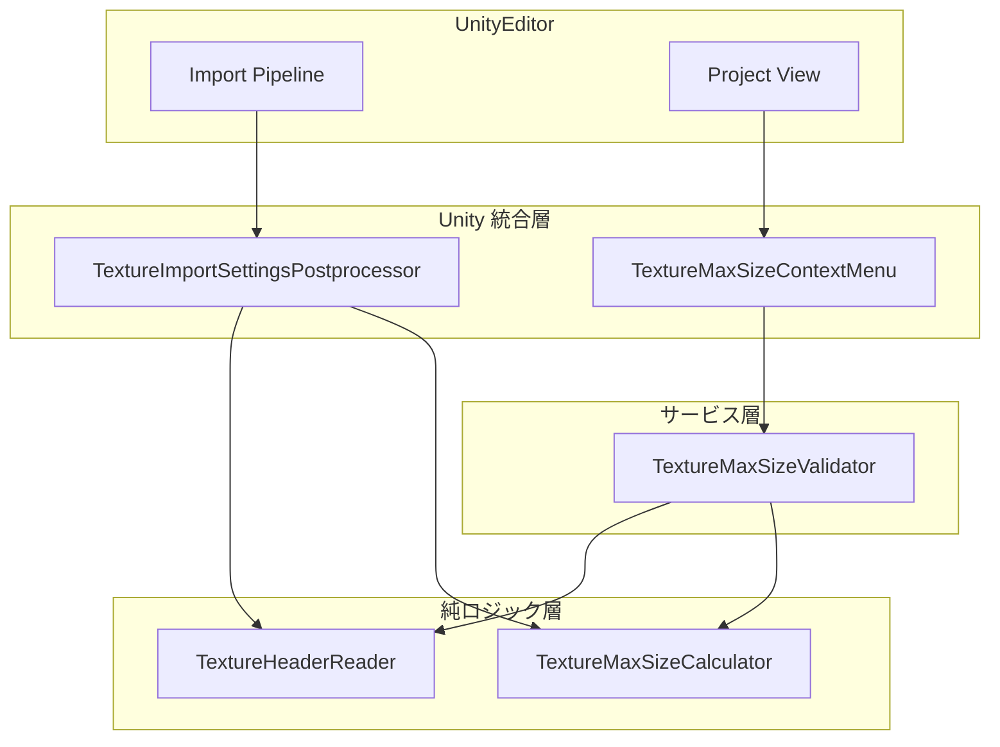
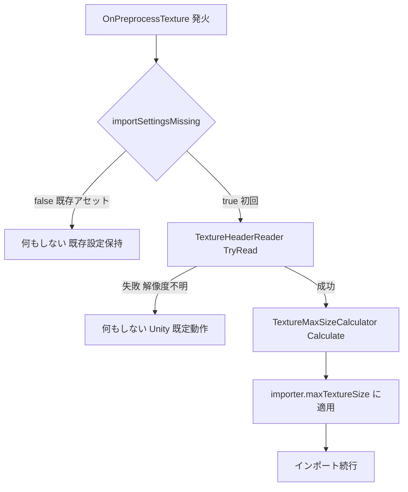
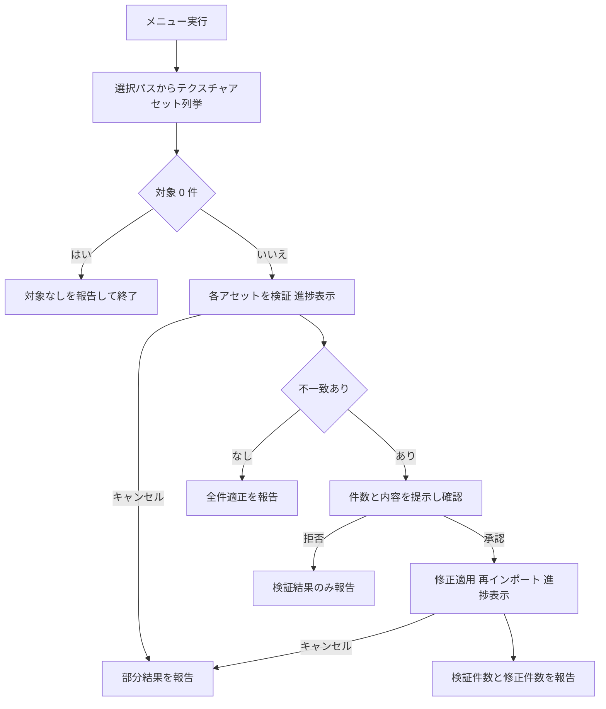

# Technical Design Document

## Overview

**Purpose**: 本機能は、アバターセットアップ作業者に対して、テクスチャアセットの maxTextureSize を実解像度に基づいて自動最適化する仕組みを提供する。4K (4096px) テクスチャが Unity 既定値 2048 で縮小されて劣化する問題を、手動操作なしで防止する。

**Users**: アバターセットアップ作業者が、(1) テクスチャをプロジェクトへ追加するだけで初回インポート時に最適な maxTextureSize が適用され、(2) 既存資産についてはプロジェクトビューの右クリックメニューから一括検証・修正を実行する。

**Impact**: `com.hidano.avatarsetuptool` パッケージの Editor アセンブリに新規コンポーネントを追加する。既存の `FbxImportSettingsPostprocessor` / `FbxHeaderReader` の流儀 (初回インポート判定・ヘッダのみ軽量読み取り・防御的エラー処理) を踏襲し、既存ファイルの変更は行わない。

### Goals
- 初回インポート時に実解像度の長辺を包含する最小の maxTextureSize を既定 (Default) インポート設定へ自動適用する
- 右クリックメニューから選択範囲以下の全テクスチャアセットの maxTextureSize を一括検証・修正できるようにする
- 9 フォーマット (PNG・JPEG・TGA・PSD・BMP・GIF・TIFF・EXR・HDR) の実解像度をヘッダ近傍の読み取りのみで取得する
- 解像度読み取り・最適値算出・検証ロジックを EditMode テストで検証可能にする

### Non-Goals
- プラットフォーム別オーバーライド (Standalone/Android 等) の設定調整
- 圧縮形式・テクスチャタイプ・Read/Write など maxTextureSize 以外のインポート設定の変更
- 画像ファイル自体のリサイズ・フォーマット変換
- ランタイム (ビルドに含まれる) 処理
- FBX インポート機能 (`FbxImportSettingsPostprocessor`) 側の変更

## Boundary Commitments

### This Spec Owns
- テクスチャアセットの既定 (Default) インポート設定における `maxTextureSize` の決定ロジックと適用タイミング (初回インポート時・メニューによる一括修正時)
- 画像ファイルヘッダからの実解像度読み取りユーティリティ (`TextureHeaderReader`) の契約
- 最適 maxTextureSize 算出規則 (32〜16384 の選択肢への切り上げ・クランプ) の定義
- プロジェクトビュー右クリックメニュー「テクスチャ最大サイズの検証・修正」の UI フロー (確認・進捗・キャンセル・報告)

### Out of Boundary
- FBX インポート設定 (`FbxImportSettingsPostprocessor` の責務)
- テクスチャの maxTextureSize 以外のあらゆるインポート設定
- プラットフォーム別オーバーライドの読み取り・書き込み
- 画像ファイル本体への書き込み (読み取り専用アクセスのみ)
- Unity が対応しない/要件外の画像フォーマット (DDS, PICT, IFF 等) の解像度取得 — 解像度不明として扱い、設定変更しない

### Allowed Dependencies
- UnityEditor API: `AssetPostprocessor` / `TextureImporter` / `AssetDatabase` / `AssetImporter` / `EditorUtility` / `Selection` / `MenuItem`
- .NET BCL: `System.IO` (FileStream, BinaryReader), `System` 基本型
- 新規外部ライブラリ・パッケージ依存は追加しない (`package.json` の dependencies は空のまま)

### Revalidation Triggers
- `TextureHeaderReader.TryRead` の契約 (シグネチャ・対応フォーマット・失敗時挙動) の変更
- maxTextureSize 選択肢リスト (32/64/.../16384) の変更 (Unity 側の Inspector 選択肢変更を含む)
- メニューパス `Assets/Avatar Setup Tool/...` の変更
- Unity バージョン更新により `TextureImporter.maxTextureSize` の作用範囲 (Default のみ) が変わった場合

## Architecture

### Existing Architecture Analysis
- **踏襲するパターン**: `FbxImportSettingsPostprocessor` の「`AssetPostprocessor` + `importSettingsMissing` による初回インポート判定」、`FbxHeaderReader` の「`internal static` + 読み取り専用 FileStream + 例外を外へ出さない防御的パーサ」
- **維持する統合点**: Editor asmdef (`Hidano.AvatarSetupTool.Editor`) にファイル追加のみ。asmdef・`AssemblyInfo.cs` (InternalsVisibleTo 設定済み) は変更不要
- **既存メニュー命名**: `Assets/Avatar Setup Tool/Capture Model Images...` (priority 1000) に倣い、本機能は同グループの priority 1001 に配置

### Architecture Pattern & Boundary Map



**Architecture Integration**:
- **Selected pattern**: 純ロジック層 + Unity 統合層の 2 層分離 (`research.md` の Architecture Pattern Evaluation 参照)。解像度読み取りと最適値算出を UnityEditor UI 非依存の純ロジックとして分離し、Postprocessor / メニューが薄く呼び出す
- **依存方向 (厳守)**: `TextureHeaderReader` / `TextureMaxSizeCalculator` (純ロジック) ← `TextureMaxSizeValidator` (サービス) ← `TextureImportSettingsPostprocessor` / `TextureMaxSizeContextMenu` (Unity 統合)。左の層は右の層を import しない。純ロジック層は UnityEditor の UI/AssetDatabase API を参照しない
- **Existing patterns preserved**: 初回インポート判定 (`importSettingsMissing`)、防御的ヘッダパーサ、`internal` + InternalsVisibleTo によるテスト公開
- **New components rationale**: Reader/Calculator の分離は 5.3 (テスト可能性)、Validator/ContextMenu の分離は 3.7 (進捗・キャンセル) のテスト可能性のため
- **Steering compliance**: `.kiro/steering/` は未整備のため、既存コードベースの流儀を規範とした

### Technology Stack

| Layer | Choice / Version | Role in Feature | Notes |
|-------|------------------|-----------------|-------|
| Editor 拡張 | Unity 6000.3 / UnityEditor API | AssetPostprocessor・TextureImporter・MenuItem・進捗 UI | 新規依存なし。既存 Editor asmdef に追加 |
| ファイル IO | .NET BCL System.IO | 画像ヘッダの読み取り専用アクセス | `FileShare.ReadWrite` で開く (FbxHeaderReader と同一) |
| テスト | Unity Test Runner (EditMode) + NUnit | 純ロジック・サービス層の自動テスト | 既存 Tests asmdef に追加 |

## File Structure Plan

### Directory Structure
```
AvatarSetupTool/Packages/com.hidano.avatarsetuptool/
├── Editor/
│   ├── TextureHeaderReader.cs              # 画像ヘッダから実解像度を読む純ロジック
│   ├── TextureMaxSizeCalculator.cs         # 最適 maxTextureSize 算出の純ロジック
│   ├── TextureImportSettingsPostprocessor.cs  # 初回インポート時の自動調整 (AssetPostprocessor)
│   ├── TextureMaxSizeValidator.cs          # 列挙・検証・修正適用サービス (UI 非依存)
│   └── TextureMaxSizeContextMenu.cs        # Assets 右クリックメニュー (ダイアログ・進捗・報告)
└── Tests/Editor/
    ├── TextureHeaderReaderTests.cs         # フォーマット別ヘッダ読み取りテスト
    ├── TextureMaxSizeCalculatorTests.cs    # 切り上げ・クランプ境界値テスト
    └── TextureMaxSizeValidatorTests.cs     # 列挙・検証・修正の統合テスト
```

### Modified Files
- なし。既存ファイル (`FbxImportSettingsPostprocessor.cs`, `FbxHeaderReader.cs`, asmdef, `AssemblyInfo.cs`) は変更しない (5.2)

> 注: 新規 `.cs` に対応する `.meta` は、プロジェクト規約に従いランダム生成した 32 桁 hex GUID で作成する (連番・ローテーション系列の GUID は禁止)。

## System Flows

### 初回インポート時の自動調整



ゲート条件: 初回インポートのみ (2.6)・解像度取得成功時のみ (2.7) の 2 重ガード。処理全体を try-catch で包み、例外発生時もインポート自体は Unity 既定動作で継続する (4.4)。

### 検証・修正メニュー



フロー上の決定: 修正の適用は確認ダイアログ承認後のみ (3.3)。検証フェーズと修正フェーズの双方でキャンセル可能 (3.7)。キャンセル時もそれまでの件数を報告する (3.5 の部分適用形)。

## Requirements Traceability

| Requirement | Summary | Components | Interfaces | Flows |
|-------------|---------|------------|------------|-------|
| 1.1 | ファイルパスから実解像度を取得 | TextureHeaderReader | `TryRead` | 自動調整 / 検証 |
| 1.2 | 9 フォーマット対応 | TextureHeaderReader | `TryRead`, `IsSupportedExtension` | — |
| 1.3 | ヘッダ近傍のみでピクセルデコードなし | TextureHeaderReader | `TryRead` (フォーマット表参照) | — |
| 1.4 | 破損・未対応・不存在は解像度不明扱い | TextureHeaderReader | `TryRead` → false | — |
| 2.1 | 長辺を包含する最小選択肢を初回適用 | Postprocessor, Calculator | `Calculate` | 自動調整 |
| 2.2 | 4096×4096 に 4096 適用 | Postprocessor, Calculator | `Calculate` | 自動調整 |
| 2.3 | 非 2 のべき乗は切り上げ | Calculator | `Calculate` | — |
| 2.4 | 16384 超は 16384 に制限 | Calculator | `Calculate` | — |
| 2.5 | 32 未満は 32 に切り上げ | Calculator | `Calculate` | — |
| 2.6 | インポート済み (.meta あり) は不変更 | Postprocessor | `importSettingsMissing` 判定 | 自動調整 |
| 2.7 | 解像度不明時は既定動作 | Postprocessor | `TryRead` false 分岐 | 自動調整 |
| 3.1 | 右クリックメニュー提供 | ContextMenu | MenuItem 契約 | 検証・修正 |
| 3.2 | 選択以下の全テクスチャを列挙・検証 | Validator | `CollectTextureAssetPaths`, `Validate` | 検証・修正 |
| 3.3 | 件数・内容提示と確認後の修正 | ContextMenu | 確認ダイアログ | 検証・修正 |
| 3.4 | 最適値へ変更し再インポート | Validator | `ApplyFixes` | 検証・修正 |
| 3.5 | 検証件数・修正件数の報告 | ContextMenu | 結果ダイアログ + ログ | 検証・修正 |
| 3.6 | 対象 0 件の報告 | Validator, ContextMenu | `CollectTextureAssetPaths` → 空 | 検証・修正 |
| 3.7 | 進捗表示とキャンセル | Validator, ContextMenu | `TextureMaxSizeProgress` | 検証・修正 |
| 4.1 | 個別失敗はスキップ・継続・ログ | Validator | `Validate` / `ApplyFixes` の失敗集計 | 検証・修正 |
| 4.2 | maxTextureSize 以外を変更しない | Postprocessor, Validator | `maxTextureSize` のみ書き込み | — |
| 4.3 | 元ファイルを変更しない | TextureHeaderReader | 読み取り専用 FileStream | — |
| 4.4 | 自動調整中の例外でもインポート継続 | Postprocessor | try-catch 全包囲 | 自動調整 |
| 5.1 | Editor アセンブリ内・エディタ限定 | 全コンポーネント | Editor asmdef 配置 | — |
| 5.2 | FBX 機能の動作不変更 | 全コンポーネント | 既存ファイル無変更 | — |
| 5.3 | 読み取り・算出ロジックのテスト可能性 | Reader, Calculator, Validator | internal + InternalsVisibleTo | — |

## Components and Interfaces

| Component | Domain/Layer | Intent | Req Coverage | Key Dependencies (P0/P1) | Contracts |
|-----------|--------------|--------|--------------|--------------------------|-----------|
| TextureHeaderReader | 純ロジック | 画像ヘッダから実解像度を取得 | 1.1–1.4, 4.3 | System.IO (P0) | Service |
| TextureMaxSizeCalculator | 純ロジック | 最適 maxTextureSize の算出 | 2.1, 2.3–2.5 | なし | Service |
| TextureImportSettingsPostprocessor | Unity 統合 | 初回インポート時の自動調整 | 2.1, 2.2, 2.6, 2.7, 4.2, 4.4, 5.1, 5.2 | Reader (P0), Calculator (P0), AssetPostprocessor (P0) | Event |
| TextureMaxSizeValidator | サービス | 列挙・検証・修正適用 | 3.2, 3.4, 3.6, 3.7, 4.1, 4.2, 5.3 | Reader (P0), Calculator (P0), AssetDatabase (P0) | Service |
| TextureMaxSizeContextMenu | Unity 統合 | メニュー UI・確認・進捗・報告 | 3.1, 3.3, 3.5–3.7 | Validator (P0), EditorUtility (P0), Selection (P0) | Service |

### 純ロジック層

#### TextureHeaderReader

| Field | Detail |
|-------|--------|
| Intent | 画像ファイルのヘッダ近傍のみを読み、実解像度 (幅・高さ) を取得する |
| Requirements | 1.1, 1.2, 1.3, 1.4, 4.3 |

**Responsibilities & Constraints**
- 対応フォーマット: PNG・JPEG・TGA・PSD (PSB 含む)・BMP・GIF・TIFF・EXR・HDR。拡張子でパーサを選択し、各パーサが先頭構造 (マジックバイト等) を検証する (フォーマット別仕様は Supporting References 参照)
- ピクセルデータのデコードを行わない。走査系パーサ (JPEG/EXR/HDR) と TIFF の IFD 読み取りには読み取り上限を設け、破損ファイルでも高速に失敗する
- ファイルは `FileMode.Open, FileAccess.Read, FileShare.ReadWrite` の読み取り専用で開く (4.3)。書き込みは行わない
- あらゆる例外 (不存在・破損・権限・未対応) を内部で捕捉し、呼び出し元へは false のみを返す (1.4)

**Dependencies**
- Inbound: TextureImportSettingsPostprocessor — 初回インポート時の解像度取得 (P0)
- Inbound: TextureMaxSizeValidator — 検証時の解像度取得 (P0)
- External: System.IO (FileStream, BinaryReader) — ファイル読み取り (P0)

**Contracts**: Service [x]

##### Service Interface
```csharp
namespace Hidano.AvatarSetupTool.Editor
{
    /// <summary>画像の実解像度 (ピクセル単位)。</summary>
    internal readonly struct TextureDimensions
    {
        public int Width { get; }
        public int Height { get; }
        /// <summary>長辺 (Max(Width, Height))。maxTextureSize 算出の入力。</summary>
        public int LongerSide { get; }
    }

    internal static class TextureHeaderReader
    {
        /// <summary>
        /// 拡張子が対応フォーマット (png/jpg/jpeg/tga/psd/psb/bmp/gif/tif/tiff/exr/hdr、
        /// 大文字小文字不問) かを返す。
        /// </summary>
        public static bool IsSupportedExtension(string path);

        /// <summary>
        /// ファイルヘッダから実解像度を読み取る。失敗時は false を返し、例外を投げない。
        /// </summary>
        public static bool TryRead(string fullPath, out TextureDimensions dimensions);
    }
}
```
- Preconditions: `fullPath` は絶対パスまたはプロジェクトルート相対パス (呼び出し側で `Path.GetFullPath` により Packages 仮想パスも解決してから渡す)
- Postconditions: 戻り値 true のとき `Width >= 1 && Height >= 1`。false のとき `dimensions` は既定値であり参照してはならない。ファイル内容は一切変更されない
- Invariants: いかなる入力でも例外を伝播しない。読み取りバイト数はフォーマット別上限 (Supporting References) を超えない

**Implementation Notes**
- Integration: `FbxHeaderReader` と同一の防御的スタイル (全体 try-catch・読み取り専用共有アクセス) を踏襲する
- Validation: フォーマットごとに最小の正常バイト列・切り詰め (破損) バイト列を用いた EditMode テストで仕様固定
- Risks: TIFF の IFD がファイル末尾にある場合はシークが発生するが、読み取り量は数 KB に収まりピクセルデコードなしの趣旨 (1.3) を満たす

#### TextureMaxSizeCalculator

| Field | Detail |
|-------|--------|
| Intent | 実解像度の長辺から最適な maxTextureSize 選択肢を算出する |
| Requirements | 2.1, 2.3, 2.4, 2.5 |

**Responsibilities & Constraints**
- 選択肢リスト `{32, 64, 128, 256, 512, 1024, 2048, 4096, 8192, 16384}` を唯一の正として保持する
- 長辺以上で最小の選択肢へ切り上げる (2.1, 2.3)。上限 16384 超は 16384 (2.4)、下限 32 未満は 32 (2.5) にクランプする
- Unity API に依存しない純関数。状態を持たない

**Dependencies**
- Inbound: TextureImportSettingsPostprocessor / TextureMaxSizeValidator — 最適値算出 (P0)

**Contracts**: Service [x]

##### Service Interface
```csharp
internal static class TextureMaxSizeCalculator
{
    /// <summary>maxTextureSize の選択肢 (昇順)。</summary>
    public static readonly int[] SizeOptions =
        { 32, 64, 128, 256, 512, 1024, 2048, 4096, 8192, 16384 };

    /// <summary>幅・高さの長辺を包含する最小の選択肢を返す (上下限クランプ込み)。</summary>
    public static int Calculate(int width, int height);
}
```
- Preconditions: `width >= 1 && height >= 1` (TextureHeaderReader の Postcondition により保証)
- Postconditions: 戻り値は `SizeOptions` に含まれる値のいずれか
- Invariants: 同一入力に対して常に同一の出力 (純関数)

**Implementation Notes**
- Validation: 境界値テスト (31→32, 32→32, 33→64, 2048→2048, 2049→4096, 4096→4096, 16384→16384, 16385→16384, 縦長・横長の長辺選択) で仕様固定
- Risks: なし (純関数)

### Unity 統合層

#### TextureImportSettingsPostprocessor

| Field | Detail |
|-------|--------|
| Intent | テクスチャの初回インポート時に maxTextureSize を実解像度基準で自動適用する |
| Requirements | 2.1, 2.2, 2.6, 2.7, 4.2, 4.4, 5.1, 5.2 |

**Responsibilities & Constraints**
- `AssetPostprocessor.OnPreprocessTexture()` でのみ動作し、以下をすべて満たす場合に限り `TextureImporter.maxTextureSize` を書き換える:
  1. `importer.importSettingsMissing == true` (初回インポート、2.6)
  2. `TextureHeaderReader.TryRead` が成功 (2.7)
- 書き込むプロパティは `maxTextureSize` のみ (4.2)。`maxTextureSize` は Default プラットフォーム設定にのみ作用するため、プラットフォーム別オーバーライドには影響しない
- メソッド本体全体を try-catch で包み、例外発生時は警告ログのみ出力してインポートを Unity 既定動作で継続させる (4.4)
- アセットのフルパス解決には `Path.GetFullPath(assetPath)` を用いる (Assets/ 直下・Packages/ 仮想パスの双方に対応)

**Dependencies**
- Inbound: Unity Import Pipeline — テクスチャインポートイベント (P0)
- Outbound: TextureHeaderReader — 実解像度取得 (P0)
- Outbound: TextureMaxSizeCalculator — 最適値算出 (P0)
- External: UnityEditor.AssetPostprocessor / TextureImporter (P0)

**Contracts**: Event [x]

##### Event Contract
- Subscribed events: `OnPreprocessTexture` (Unity Import Pipeline がテクスチャアセットのインポート直前に呼び出す)
- Published events: なし
- Ordering / delivery guarantees: Unity のインポートパイプラインに従う。`OnPreprocessTexture` 内での importer 設定変更はそのインポートに反映され、再インポートループは発生しない。既存の `FbxImportSettingsPostprocessor` (モデル対象) とはイベント種別が異なり相互干渉しない (5.2)

**Implementation Notes**
- Integration: `FbxImportSettingsPostprocessor` と同じ `sealed class` + 早期 return スタイル。クラス構造を揃えることでレビュー容易性を保つ
- Validation: EditMode テストで「.meta なしファイルのインポート → maxTextureSize が最適値」「既存アセットの再インポート → 設定不変」を検証
- Risks: すべての新規テクスチャに発火するため、他機能が生成する小型画像 (キャプチャ出力等) にも適用される。長辺基準の切り上げは劣化を生まないため実害なしと判断

#### TextureMaxSizeContextMenu

| Field | Detail |
|-------|--------|
| Intent | 右クリックメニューから検証・修正フローを提供する (確認・進捗・キャンセル・報告) |
| Requirements | 3.1, 3.3, 3.5, 3.6, 3.7 |

**Responsibilities & Constraints**
- MenuItem `Assets/Avatar Setup Tool/Validate Texture Max Size` (priority 1001) と validate 関数 (`Selection.assetGUIDs.Length > 0` で有効化) を提供する (3.1)
- System Flows「検証・修正メニュー」のフローを制御する: 列挙 → 検証 (進捗) → 確認ダイアログ → 修正 (進捗) → 結果報告
- 確認ダイアログには修正対象件数を表示し、個別の内容 (アセットパス・現在値→最適値) は Console ログに出力する (3.3)
- 結果報告は `EditorUtility.DisplayDialog` で検証件数・修正件数・スキップ件数を提示する (3.5, 3.6)。キャンセル時はその時点までの件数を報告する
- 進捗は `EditorUtility.DisplayCancelableProgressBar` で表示し、戻り値を `TextureMaxSizeProgress` デリゲート経由で Validator に伝える (3.7)。try/finally で `ClearProgressBar` を必ず実行する
- 業務判断 (どのアセットが不一致か・何を修正するか) は持たず、Validator へ委譲する

**Dependencies**
- Inbound: Unity Project View — メニュー操作 (P0)
- Outbound: TextureMaxSizeValidator — 列挙・検証・修正 (P0)
- External: UnityEditor.EditorUtility / Selection / MenuItem (P0)

**Contracts**: Service [x]

##### Service Interface
```csharp
internal static class TextureMaxSizeContextMenu
{
    [MenuItem("Assets/Avatar Setup Tool/Validate Texture Max Size", false, 1001)]
    private static void ValidateAndFix();

    [MenuItem("Assets/Avatar Setup Tool/Validate Texture Max Size", true)]
    private static bool ValidateMenu(); // Selection.assetGUIDs.Length > 0
}
```
- Preconditions: プロジェクトビューで 1 つ以上のアセット/フォルダが選択されている
- Postconditions: ユーザー承認なしにインポート設定が変更されることはない。プログレスバーは処理終了時に必ず消える

**Implementation Notes**
- Integration: メニューパス・priority は既存 `Capture Model Images...` (1000) の直後に並ぶよう 1001 とする
- Validation: UI 層のためダイアログ自体は手動確認。ロジックは Validator 側テストで担保
- Risks: ダイアログ文言はスペックの language (ja) に合わせて日本語とする

### サービス層

#### TextureMaxSizeValidator

| Field | Detail |
|-------|--------|
| Intent | 選択パス以下のテクスチャ列挙・maxTextureSize 適否検証・修正適用を UI 非依存で行う |
| Requirements | 3.2, 3.4, 3.6, 3.7, 4.1, 4.2, 5.3 |

**Responsibilities & Constraints**
- 列挙: 選択パス群からテクスチャアセットパスを重複なく列挙する。フォルダは `AssetDatabase.FindAssets("t:Texture2D", ...)` でサブフォルダ込み、単一ファイルは `AssetImporter.GetAtPath` が `TextureImporter` であるかで判別する (3.2)
- 検証: 各アセットについて実解像度から最適値を算出し、`TextureImporter.maxTextureSize` (Default 設定) と**完全一致**するかを判定する。不一致 (過大・過小とも) を Issue として収集する (3.2、判定方針は `research.md` の Design Decision 参照)
- 修正: Issue の `maxTextureSize` を最適値に書き換え `SaveAndReimport()` する (3.4)。複数件の場合は `AssetDatabase.StartAssetEditing` / `StopAssetEditing` (try/finally) でバッチ化する
- 個別アセットの失敗 (解像度取得不能・importer 取得不能・再インポート例外) はスキップ件数/失敗件数として集計し、`Debug.LogWarning` でアセットパスと理由を出力して処理を継続する (4.1)
- 書き込むのは `maxTextureSize` のみ (4.2)
- 進捗デリゲートが false を返した時点で処理を中断し、`Cancelled = true` の部分結果を返す (3.7)

**Dependencies**
- Inbound: TextureMaxSizeContextMenu — メニューフローからの呼び出し (P0)
- Outbound: TextureHeaderReader / TextureMaxSizeCalculator — 検証基準の取得 (P0)
- External: UnityEditor.AssetDatabase / AssetImporter / TextureImporter (P0)

**Contracts**: Service [x]

##### Service Interface
```csharp
namespace Hidano.AvatarSetupTool.Editor
{
    /// <summary>進捗通知。false を返すとキャンセル。</summary>
    internal delegate bool TextureMaxSizeProgress(int current, int total, string assetPath);

    /// <summary>maxTextureSize が最適値と一致しないアセット 1 件分。</summary>
    internal readonly struct TextureMaxSizeIssue
    {
        public string AssetPath { get; }
        public int Width { get; }
        public int Height { get; }
        public int CurrentMaxSize { get; }
        public int OptimalMaxSize { get; }
    }

    /// <summary>検証フェーズの結果。</summary>
    internal sealed class TextureMaxSizeValidationReport
    {
        public IReadOnlyList<TextureMaxSizeIssue> Issues { get; }
        public int ScannedCount { get; }   // 検証を試行した件数
        public int SkippedCount { get; }   // 解像度不明等でスキップした件数
        public bool Cancelled { get; }
    }

    /// <summary>修正フェーズの結果。</summary>
    internal readonly struct TextureMaxSizeFixResult
    {
        public int FixedCount { get; }
        public int FailedCount { get; }
        public bool Cancelled { get; }
    }

    internal static class TextureMaxSizeValidator
    {
        /// <summary>選択パス群 (ファイル・フォルダ混在可) からテクスチャアセットパスを重複なく列挙する。</summary>
        public static IReadOnlyList<string> CollectTextureAssetPaths(
            IReadOnlyList<string> selectedAssetPaths);

        /// <summary>各アセットの maxTextureSize が最適値と一致するか検証する。progress は null 可。</summary>
        public static TextureMaxSizeValidationReport Validate(
            IReadOnlyList<string> assetPaths, TextureMaxSizeProgress progress);

        /// <summary>Issue の maxTextureSize を最適値へ変更し再インポートする。progress は null 可。</summary>
        public static TextureMaxSizeFixResult ApplyFixes(
            IReadOnlyList<TextureMaxSizeIssue> issues, TextureMaxSizeProgress progress);
    }
}
```
- Preconditions: `selectedAssetPaths` は AssetDatabase 上のパス (`Assets/...` または `Packages/...`)。`ApplyFixes` は `Validate` が返した Issue を入力とする
- Postconditions: `Validate` はアセットのいかなる設定も変更しない (読み取りのみ)。`ApplyFixes` は Issue に含まれるアセットの `maxTextureSize` 以外を変更しない。`ScannedCount = Issues.Count + 一致件数 + SkippedCount`
- Invariants: 個別アセットの失敗で例外を伝播しない。進捗デリゲートは 1 アセット処理ごとに 1 回呼ばれる

**Implementation Notes**
- Integration: `CollectTextureAssetPaths` が空リストを返した場合の「対象なし」報告 (3.6) は ContextMenu 側の責務
- Validation: EditMode テストで一時アセット (EncodeToPNG で生成し `Assets/` 配下へインポート) を用い、列挙・検証・修正・スキップ・キャンセルの各経路を検証。テスト後は生成アセットを必ず削除する
- Risks: 修正フェーズの再インポートで Postprocessor が再発火するが、修正対象は .meta 既存アセットのため `importSettingsMissing == false` となり自動調整は走らない (2.6 が再入を防ぐ)

## Data Models

本機能は永続データを持たない。扱う値オブジェクトは Components に定義済みの `TextureDimensions` / `TextureMaxSizeIssue` / `TextureMaxSizeValidationReport` / `TextureMaxSizeFixResult` のみであり、すべてメソッド呼び出しスコープで生成・破棄される。永続状態は Unity が管理する `.meta` (TextureImporter 設定) のみで、その書き込みは `maxTextureSize` フィールドに限定される。

## Error Handling

### Error Strategy
「個別失敗はスキップして継続、全体は決して壊さない」を原則とする。純ロジック層は例外を外に出さず bool で失敗を表現し、Unity 統合層は try-catch / try-finally で Unity 環境 (インポートパイプライン・プログレスバー) を汚さない。

### Error Categories and Responses
- **入力異常 (ファイル不存在・破損・未対応フォーマット)**: `TextureHeaderReader.TryRead` が false → 呼び出し側は「解像度不明」として扱う。Postprocessor は無変更 (2.7)、Validator はスキップ集計 + 警告ログ (4.1)
- **個別アセットの処理失敗 (importer 取得不能・再インポート例外)**: Validator がスキップ/失敗として集計し、アセットパスと理由を `Debug.LogWarning` で出力して残りを継続 (4.1)
- **自動調整中の予期しない例外**: Postprocessor が捕捉して警告ログのみ出力し、インポートは Unity 既定動作で続行 (4.4)
- **ユーザーキャンセル**: エラーではなく正常系。部分結果 (`Cancelled = true`) を報告に反映 (3.7)
- **メニュー処理中の例外**: ContextMenu の try/finally で `ClearProgressBar` / `StopAssetEditing` を保証し、エディタを操作不能にしない

### Monitoring
- 警告ログは `Debug.LogWarning` に統一し、先頭に `[TextureMaxSize]` プレフィックスとアセットパスを含めて Console から追跡可能にする
- 一括処理の完了報告 (検証件数・修正件数・スキップ件数) は結果ダイアログと `Debug.Log` の両方に出力する

## Testing Strategy

### Unit Tests (Tests/Editor)
1. **TextureMaxSizeCalculatorTests**: 境界値網羅 — 31→32 / 32→32 / 33→64 / 2048→2048 / 2049→4096 / 4096→4096 / 16384→16384 / 16385→16384、縦長・横長での長辺選択 (2.1, 2.3–2.5)
2. **TextureHeaderReaderTests (正常系)**: 9 フォーマットの最小正常バイト列 (テストコード内で合成、または EncodeToPNG/EncodeToJPG/EncodeToTGA/EncodeToEXR 出力) を一時ファイルへ書き、既知の幅・高さが取得できること (1.1, 1.2)
3. **TextureHeaderReaderTests (異常系)**: 不存在パス・0 バイト・マジック不一致・途中切り詰めファイルで false が返り例外が出ないこと (1.4)。読み取り後にファイルのタイムスタンプ/内容が不変であること (4.3)
4. **TextureHeaderReaderTests (走査上限)**: 巨大ダミー (ヘッダ正常 + 大きな本体) で読み取りが即時完了すること (1.3)

### Integration Tests (EditMode, 一時アセット使用)
1. **初回インポート自動調整**: .meta なしで `Assets/` 配下へ画像ファイルを配置し `AssetDatabase.ImportAsset` → `TextureImporter.maxTextureSize` が最適値になること (2.1, 2.2)。4096×4096 PNG で 4096 になることを明示的に検証
2. **既存アセット保持**: インポート済みアセットの maxTextureSize を手動変更後に再インポートしても値が保持されること (2.6)
3. **Validator 列挙**: フォルダ選択 (サブフォルダ込み)・ファイル選択・混在・重複・非テクスチャ混在で正しく列挙されること、テクスチャ 0 件で空リストが返ること (3.2, 3.6)
4. **Validator 検証・修正**: 不一致アセットが Issue 化され、`ApplyFixes` 後に maxTextureSize が最適値へ変わり、それ以外の設定 (例: textureType, isReadable) が不変であること (3.2, 3.4, 4.2)
5. **スキップ・キャンセル**: 破損ファイル混在時に残りが処理され件数が正しいこと (4.1)、進捗デリゲートが false を返すと `Cancelled = true` の部分結果になること (3.7)

### 手動確認 (UI)
- メニュー表示・有効化条件、確認ダイアログ、進捗バー、結果ダイアログの文言と挙動 (3.1, 3.3, 3.5)

## Performance & Scalability
- 検証フェーズ: 1 アセットあたりの読み取りはフォーマット別上限 (下表) の範囲内で、数千アセットでも実用速度を維持する。進捗表示により長時間処理でも操作性を保つ
- 修正フェーズ: 再インポートが支配的コスト。`StartAssetEditing` / `StopAssetEditing` でバッチ化し、キャンセルで途中打ち切り可能とする
- 目標値: 検証のみ (再インポートなし) は 1,000 アセットあたり数秒以内 (ヘッダ IO のみのため)

## Supporting References

### フォーマット別ヘッダ仕様 (TextureHeaderReader の実装契約)

| 形式 | 拡張子 | 構造検証 | 解像度の位置 | 読み取り上限の目安 |
|------|--------|----------|--------------|--------------------|
| PNG | .png | 8 byte シグネチャ | IHDR: offset 16 に幅 (BE u32)、offset 20 に高さ (BE u32) | 先頭 33 bytes |
| JPEG | .jpg .jpeg | FF D8 | SOFn マーカー (C0–CF、ただし C4/C8/CC 除く) 内の高さ・幅 (BE u16)。セグメント長でスキップしながら走査 | マーカー走査 (セグメント長スキップ、走査上限 ~1 MB) |
| TGA | .tga | マジックなし (拡張子必須)。幅・高さ > 0 で妥当性確認 | offset 12 に幅 (LE u16)、offset 14 に高さ (LE u16) | 先頭 18 bytes |
| PSD/PSB | .psd .psb | "8BPS" + version 1 (PSD) / 2 (PSB) | offset 14 に高さ (BE u32)、offset 18 に幅 (BE u32) | 先頭 22 bytes |
| BMP | .bmp | "BM" | BITMAPINFOHEADER: offset 18 に幅 (LE s32)、offset 22 に高さ (LE s32、絶対値)。ヘッダサイズ 12 (BITMAPCOREHEADER) の場合は u16 | 先頭 26 bytes |
| GIF | .gif | "GIF87a" / "GIF89a" | offset 6 に幅 (LE u16)、offset 8 に高さ (LE u16) — 論理スクリーンサイズ | 先頭 10 bytes |
| TIFF | .tif .tiff | "II\*\0" (LE) / "MM\0\*" (BE) | offset 4 の IFD オフセットへシークし、tag 256 (ImageWidth) / 257 (ImageLength) を読む。値型 SHORT/LONG 両対応 | IFD エントリ数上限 (例: 512) で防御 |
| EXR | .exr | 76 2F 31 01 | ヘッダ属性リストから `dataWindow` (box2i: xMin,yMin,xMax,yMax 各 LE s32) を走査し、幅 = xMax−xMin+1、高さ = yMax−yMin+1。マルチパートは最初のヘッダを採用 | 属性走査上限 (例: 64 KB) で防御 |
| HDR | .hdr | "#?RADIANCE" / "#?RGBE" | テキストヘッダの空行後にある解像度行 (例: `-Y 1024 +X 2048`) を走査 | テキスト走査上限 (例: 8 KB) で防御 |

- 各パーサは表の「構造検証」に失敗した時点で false を返す (拡張子と内容の不一致 = 破損扱い、1.4)
- 幅・高さが 0 以下、または非現実的な値 (例: 1,000,000 超) の場合も false とする (破損データ防御)
- 調査の経緯・代替案は `research.md` の Research Log を参照
